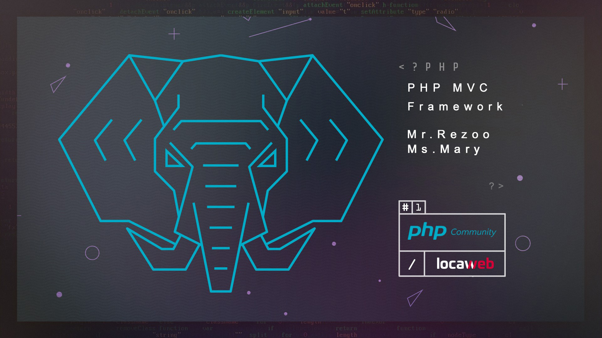

# PHP MVC Framework




Hello friends of these are [Mr.Rezoo](https://www.linkedin.com/in/reza-mobaraki/) | [Miss.mary](https://www.linkedin.com/in/maryam-ostovar-64b497210/)

## Table of contents

* [General info](#General-info)
* [Technologies](#Technologies)
* [Help](#Help)
* [Setup](#Setup)
* [Credits](#credits)
* [Contributors](#Contributors)
* [License](#license)

## General info

We started this project in 17th april


## Technologies

Project is created with:

* php: 8.0.8
* composer: 2.1.3
* vlucas/phpdotenv: 5.3

## Help

If you are considering a particular method, more modern technology Add to my
project and send merge request, I will add you in the credits and contributors
section

## Setup

* install third party packages
```shell
 composer install
```
* build tables and run migrations 
```shell
 php migrations.php
```
---
* if want to run project on LOCAL 
```shell
 do - php -S localhost:8080 -t public/
```
---

## Credits

* [thecodeholic](https://github.com/thecodeholic)

## Contributors

* [Mr.Rezoo](https://github.com/MrRezoo)
* [Miss.maryam](https://github.com/maryost1998)
* [Jalallinux](https://github.com/jalallinux)

## License

Distributed under the GPL License. See [license](LICENSE) for more information.
